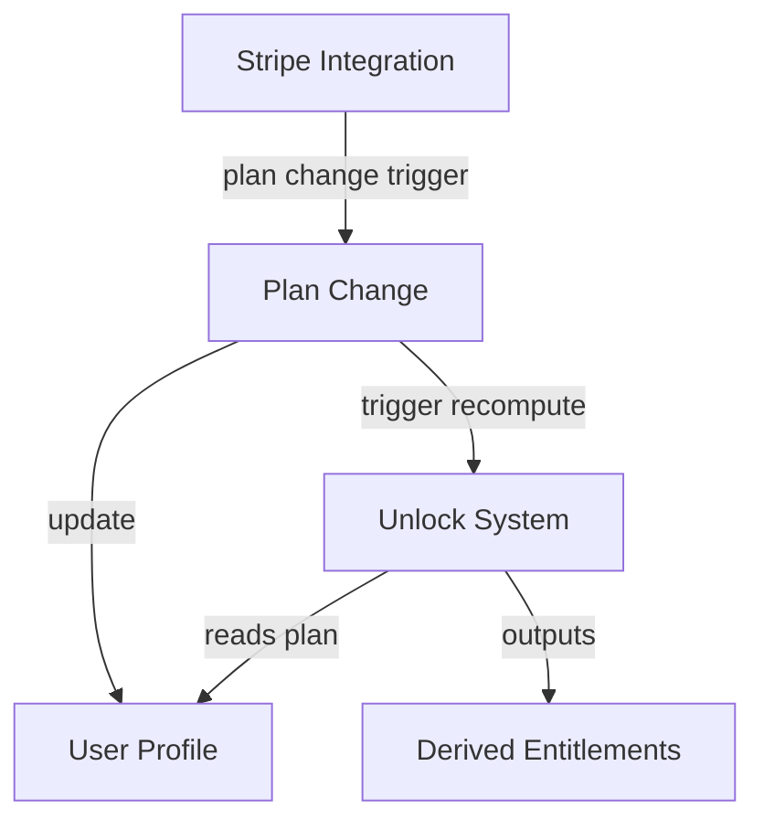

## Objective
Document the integration flow, triggers, data contracts, and error propagation between all four layers of the access and plan system.

## High-Level Flow

1. **Stripe Integration** triggers **Plan Change** on payment events.
2. **Plan Change** updates **User Profile** and triggers **Unlock System** recomputation.
3. **Unlock System** reads from **User Profile** to compute entitlements.
4. **User Profile** is the source of truth for plan state, used by all other layers.

## Mermaid Diagram

## Interface Contracts

- **Stripe Integration → Plan Change**: Triggers plan transitions via validated events. No direct plan mutation.
- **Plan Change → User Profile**: Updates plan state. Only allowed transitions. Idempotent.
- **Plan Change → Unlock System**: Triggers entitlement recomputation after plan change.
- **Unlock System → User Profile**: Reads plan and user state to compute entitlements. No writes.

## Error Propagation
- Stripe event failures: logged, retried, or ignored (never partial state)
- Plan change failures: surfaced to Stripe layer for retry/queue
- Unlock system errors: always recompute from current state; no partial unlocks
- User profile errors: validation and lookup failures surfaced to callers

## Extension Points
- Add new payment providers (extend Stripe Integration)
- Add new plan types or unlock rules (extend Plan Change, Unlock System)
- Add new entitlement types (extend User Profile)

## Example Scenario
- User upgrades via Stripe → Stripe webhook triggers plan-change → plan-change updates user-profile and triggers unlock-system → unlock-system recomputes entitlements
